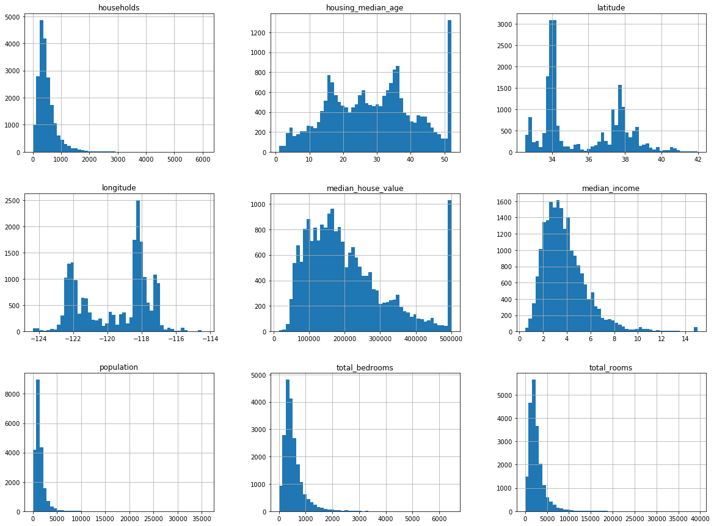
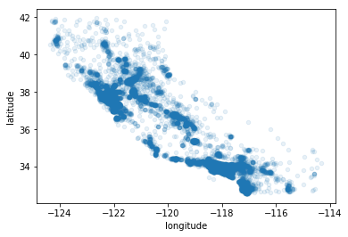
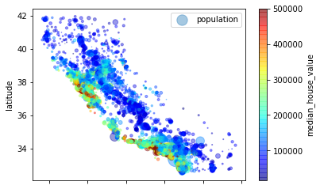
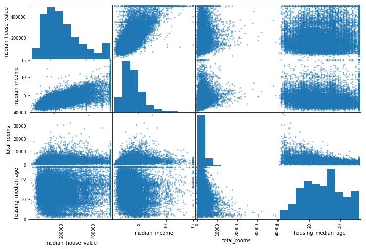
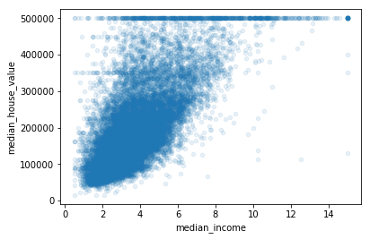

```python
print("Hello World")
```

    Hello World
    


```python
import os
import tarfile
from six.moves import urllib
DOWNLOAD_ROOT = "https://raw.githubusercontent.com/ageron/handson-ml/master/"
HOUSING_PATH = "datasets/housing"
HOUSING_URL = DOWNLOAD_ROOT+HOUSING_PATH+"/housing.tgz"
def fetch_housing_data(housing_url = HOUSING_URL, housing_path = HOUSING_PATH):
    if not os.path.isdir(housing_path):
        os.makedirs(housing_path)
    tgz_path = os.path.join(housing_path,"housing.tgz")
    urllib.request.urlretrieve(housing_url,tgz_path)
    housing_tgz = tarfile.open(tgz_path)
    housing_tgz.extractall(path=housing_path)
    housing_tgz.close()
    
```


```python
fetch_housing_data()
```


```python
import pandas as pd
def load_housing_data(housing_path=HOUSING_PATH):
    csv_path = os.path.join(housing_path,"housing.csv")
    return pd.read_csv(csv_path)
housing = load_housing_data()
housing.head()
```


<div>
<style>
    .dataframe thead tr:only-child th {
        text-align: right;
    }

    .dataframe thead th {
        text-align: left;
    }

    .dataframe tbody tr th {
        vertical-align: top;
    }
</style>
<table border="1" class="dataframe">
  <thead>
    <tr style="text-align: right;">
      <th></th>
      <th>longitude</th>
      <th>latitude</th>
      <th>housing_median_age</th>
      <th>total_rooms</th>
      <th>total_bedrooms</th>
      <th>population</th>
      <th>households</th>
      <th>median_income</th>
      <th>median_house_value</th>
      <th>ocean_proximity</th>
    </tr>
  </thead>
  <tbody>
    <tr>
      <th>0</th>
      <td>-122.23</td>
      <td>37.88</td>
      <td>41.0</td>
      <td>880.0</td>
      <td>129.0</td>
      <td>322.0</td>
      <td>126.0</td>
      <td>8.3252</td>
      <td>452600.0</td>
      <td>NEAR BAY</td>
    </tr>
    <tr>
      <th>1</th>
      <td>-122.22</td>
      <td>37.86</td>
      <td>21.0</td>
      <td>7099.0</td>
      <td>1106.0</td>
      <td>2401.0</td>
      <td>1138.0</td>
      <td>8.3014</td>
      <td>358500.0</td>
      <td>NEAR BAY</td>
    </tr>
    <tr>
      <th>2</th>
      <td>-122.24</td>
      <td>37.85</td>
      <td>52.0</td>
      <td>1467.0</td>
      <td>190.0</td>
      <td>496.0</td>
      <td>177.0</td>
      <td>7.2574</td>
      <td>352100.0</td>
      <td>NEAR BAY</td>
    </tr>
    <tr>
      <th>3</th>
      <td>-122.25</td>
      <td>37.85</td>
      <td>52.0</td>
      <td>1274.0</td>
      <td>235.0</td>
      <td>558.0</td>
      <td>219.0</td>
      <td>5.6431</td>
      <td>341300.0</td>
      <td>NEAR BAY</td>
    </tr>
    <tr>
      <th>4</th>
      <td>-122.25</td>
      <td>37.85</td>
      <td>52.0</td>
      <td>1627.0</td>
      <td>280.0</td>
      <td>565.0</td>
      <td>259.0</td>
      <td>3.8462</td>
      <td>342200.0</td>
      <td>NEAR BAY</td>
    </tr>
  </tbody>
</table>
</div>


```python
housing.info()
```

    <class 'pandas.core.frame.DataFrame'>
    RangeIndex: 20640 entries, 0 to 20639
    Data columns (total 10 columns):
    longitude             20640 non-null float64
    latitude              20640 non-null float64
    housing_median_age    20640 non-null float64
    total_rooms           20640 non-null float64
    total_bedrooms        20433 non-null float64
    population            20640 non-null float64
    households            20640 non-null float64
    median_income         20640 non-null float64
    median_house_value    20640 non-null float64
    ocean_proximity       20640 non-null object
    dtypes: float64(9), object(1)
    memory usage: 1.6+ MB
    


```python
housing["ocean_proximity"].value_counts()
```


    <1H OCEAN     9136
    INLAND        6551
    NEAR OCEAN    2658
    NEAR BAY      2290
    ISLAND           5
    Name: ocean_proximity, dtype: int64


```python
housing.describe()
```


<div>
<style>
    .dataframe thead tr:only-child th {
        text-align: right;
    }

    .dataframe thead th {
        text-align: left;
    }

    .dataframe tbody tr th {
        vertical-align: top;
    }
</style>
<table border="1" class="dataframe">
  <thead>
    <tr style="text-align: right;">
      <th></th>
      <th>longitude</th>
      <th>latitude</th>
      <th>housing_median_age</th>
      <th>total_rooms</th>
      <th>total_bedrooms</th>
      <th>population</th>
      <th>households</th>
      <th>median_income</th>
      <th>median_house_value</th>
    </tr>
  </thead>
  <tbody>
    <tr>
      <th>count</th>
      <td>20640.000000</td>
      <td>20640.000000</td>
      <td>20640.000000</td>
      <td>20640.000000</td>
      <td>20433.000000</td>
      <td>20640.000000</td>
      <td>20640.000000</td>
      <td>20640.000000</td>
      <td>20640.000000</td>
    </tr>
    <tr>
      <th>mean</th>
      <td>-119.569704</td>
      <td>35.631861</td>
      <td>28.639486</td>
      <td>2635.763081</td>
      <td>537.870553</td>
      <td>1425.476744</td>
      <td>499.539680</td>
      <td>3.870671</td>
      <td>206855.816909</td>
    </tr>
    <tr>
      <th>std</th>
      <td>2.003532</td>
      <td>2.135952</td>
      <td>12.585558</td>
      <td>2181.615252</td>
      <td>421.385070</td>
      <td>1132.462122</td>
      <td>382.329753</td>
      <td>1.899822</td>
      <td>115395.615874</td>
    </tr>
    <tr>
      <th>min</th>
      <td>-124.350000</td>
      <td>32.540000</td>
      <td>1.000000</td>
      <td>2.000000</td>
      <td>1.000000</td>
      <td>3.000000</td>
      <td>1.000000</td>
      <td>0.499900</td>
      <td>14999.000000</td>
    </tr>
    <tr>
      <th>25%</th>
      <td>-121.800000</td>
      <td>33.930000</td>
      <td>18.000000</td>
      <td>1447.750000</td>
      <td>296.000000</td>
      <td>787.000000</td>
      <td>280.000000</td>
      <td>2.563400</td>
      <td>119600.000000</td>
    </tr>
    <tr>
      <th>50%</th>
      <td>-118.490000</td>
      <td>34.260000</td>
      <td>29.000000</td>
      <td>2127.000000</td>
      <td>435.000000</td>
      <td>1166.000000</td>
      <td>409.000000</td>
      <td>3.534800</td>
      <td>179700.000000</td>
    </tr>
    <tr>
      <th>75%</th>
      <td>-118.010000</td>
      <td>37.710000</td>
      <td>37.000000</td>
      <td>3148.000000</td>
      <td>647.000000</td>
      <td>1725.000000</td>
      <td>605.000000</td>
      <td>4.743250</td>
      <td>264725.000000</td>
    </tr>
    <tr>
      <th>max</th>
      <td>-114.310000</td>
      <td>41.950000</td>
      <td>52.000000</td>
      <td>39320.000000</td>
      <td>6445.000000</td>
      <td>35682.000000</td>
      <td>6082.000000</td>
      <td>15.000100</td>
      <td>500001.000000</td>
    </tr>
  </tbody>
</table>
</div>


```python
%matplotlib inline
import matplotlib.pyplot as plt
housing.hist(bins=50, figsize=(20,15))
plt.show()
```





```python
from sklearn.model_selection import train_test_split
train_set, test_set = train_test_split(housing,test_size=0.2, random_state=42)
print(len(train_set),"train+", len(test_set),"test")
```

    16512 train+ 4128 test
    


```python
import numpy as np
housing["income_cat"] = np.ceil(housing["median_income"]/1.5)
housing["income_cat"].where(housing["income_cat"]<5, 5.0, inplace=True)
```


```python
from sklearn.model_selection import StratifiedShuffleSplit
split=StratifiedShuffleSplit(n_splits=1,test_size=0.2, random_state=42)
for train_index, test_index in split.split(housing,housing["income_cat"]):
    strat_train_set = housing.loc[train_index]
    strat_test_set = housing.loc[test_index]
housing["income_cat"].value_counts()
```


    3.0    7236
    2.0    6581
    4.0    3639
    5.0    2362
    1.0     822
    Name: income_cat, dtype: int64


```python
for set in (strat_train_set, strat_test_set):
    set.drop(["income_cat"],axis=1,inplace=True)
```


```python
housing = strat_train_set.copy()
housing.plot(kind="scatter", x="longitude",y="latitude", alpha = 0.1)
plt.show()
```





```python
housing = strat_train_set.copy()
housing.plot(kind="scatter", x="longitude",y="latitude", alpha = 0.4,
            s = housing["population"]/100,label="population", c = "median_house_value",cmap=plt.get_cmap("jet"), colorbar=True)
plt.legend()
```


    <matplotlib.legend.Legend at 0x1d09ba62cf8>





```python
corr_matrix = housing.corr()
corr_matrix["median_house_value"].sort_values(ascending=False)
```


    median_house_value    1.000000
    median_income         0.687160
    total_rooms           0.135097
    housing_median_age    0.114110
    households            0.064506
    total_bedrooms        0.047689
    population           -0.026920
    longitude            -0.047432
    latitude             -0.142724
    Name: median_house_value, dtype: float64


```python
from pandas.plotting import scatter_matrix
attributes = ["median_house_value", "median_income", "total_rooms", "housing_median_age"]
scatter_matrix(housing[attributes], figsize=(12,8))
```


    array([[<matplotlib.axes._subplots.AxesSubplot object at 0x000001D09B890940>,
            <matplotlib.axes._subplots.AxesSubplot object at 0x000001D099EEF940>,
            <matplotlib.axes._subplots.AxesSubplot object at 0x000001D099ED0160>,
            <matplotlib.axes._subplots.AxesSubplot object at 0x000001D09A00C128>],
           [<matplotlib.axes._subplots.AxesSubplot object at 0x000001D09B0E5080>,
            <matplotlib.axes._subplots.AxesSubplot object at 0x000001D09B0E5F28>,
            <matplotlib.axes._subplots.AxesSubplot object at 0x000001D09B051F28>,
            <matplotlib.axes._subplots.AxesSubplot object at 0x000001D09D51C470>],
           [<matplotlib.axes._subplots.AxesSubplot object at 0x000001D09E707A90>,
            <matplotlib.axes._subplots.AxesSubplot object at 0x000001D09E5B1748>,
            <matplotlib.axes._subplots.AxesSubplot object at 0x000001D09D7EB160>,
            <matplotlib.axes._subplots.AxesSubplot object at 0x000001D09A8775F8>],
           [<matplotlib.axes._subplots.AxesSubplot object at 0x000001D09DA3D9E8>,
            <matplotlib.axes._subplots.AxesSubplot object at 0x000001D09DA88128>,
            <matplotlib.axes._subplots.AxesSubplot object at 0x000001D09DED5470>,
            <matplotlib.axes._subplots.AxesSubplot object at 0x000001D09AFE5A20>]], dtype=object)





```python
housing.plot(kind="scatter", x="median_income",y="median_house_value", alpha = 0.1)
plt.show()
```





```python
housing["rooms_per_household"] = housing["total_rooms"]/housing["households"]
housing["bedrooms_per_room"] = housing["total_bedrooms"]/housing["total_rooms"]
housing["population_per_household"] = housing["population"]/housing["households"]
corr_matrix = housing.corr()
corr_matrix["median_house_value"].sort_values(ascending=False)
```


    median_house_value          1.000000
    median_income               0.687160
    rooms_per_household         0.146285
    total_rooms                 0.135097
    housing_median_age          0.114110
    households                  0.064506
    total_bedrooms              0.047689
    population_per_household   -0.021985
    population                 -0.026920
    longitude                  -0.047432
    latitude                   -0.142724
    bedrooms_per_room          -0.259984
    Name: median_house_value, dtype: float64


```python
housing = strat_train_set.drop("median_house_value",axis = 1)
housing_labels = strat_train_set["median_house_value"].copy()
```


```python
from sklearn.preprocessing import Imputer
imputer = Imputer(strategy="median")
housing_num = housing.drop("ocean_proximity", axis = 1)
imputer.fit(housing_num)
```


    Imputer(axis=0, copy=True, missing_values='NaN', strategy='median', verbose=0)


```python
imputer.statistics_
```


    array([ -118.51  ,    34.26  ,    29.    ,  2119.5   ,   433.    ,
            1164.    ,   408.    ,     3.5409])


```python
X = imputer.transform(housing_num)
housing_tr = pd.DataFrame(X, columns=housing_num.columns)
```


```python
housing_tr.describe()
```


<div>
<style>
    .dataframe thead tr:only-child th {
        text-align: right;
    }

    .dataframe thead th {
        text-align: left;
    }

    .dataframe tbody tr th {
        vertical-align: top;
    }
</style>
<table border="1" class="dataframe">
  <thead>
    <tr style="text-align: right;">
      <th></th>
      <th>longitude</th>
      <th>latitude</th>
      <th>housing_median_age</th>
      <th>total_rooms</th>
      <th>total_bedrooms</th>
      <th>population</th>
      <th>households</th>
      <th>median_income</th>
    </tr>
  </thead>
  <tbody>
    <tr>
      <th>count</th>
      <td>16512.000000</td>
      <td>16512.000000</td>
      <td>16512.000000</td>
      <td>16512.000000</td>
      <td>16512.000000</td>
      <td>16512.000000</td>
      <td>16512.000000</td>
      <td>16512.000000</td>
    </tr>
    <tr>
      <th>mean</th>
      <td>-119.575834</td>
      <td>35.639577</td>
      <td>28.653101</td>
      <td>2622.728319</td>
      <td>533.998123</td>
      <td>1419.790819</td>
      <td>497.060380</td>
      <td>3.875589</td>
    </tr>
    <tr>
      <th>std</th>
      <td>2.001860</td>
      <td>2.138058</td>
      <td>12.574726</td>
      <td>2138.458419</td>
      <td>410.839621</td>
      <td>1115.686241</td>
      <td>375.720845</td>
      <td>1.904950</td>
    </tr>
    <tr>
      <th>min</th>
      <td>-124.350000</td>
      <td>32.540000</td>
      <td>1.000000</td>
      <td>6.000000</td>
      <td>2.000000</td>
      <td>3.000000</td>
      <td>2.000000</td>
      <td>0.499900</td>
    </tr>
    <tr>
      <th>25%</th>
      <td>-121.800000</td>
      <td>33.940000</td>
      <td>18.000000</td>
      <td>1443.000000</td>
      <td>296.000000</td>
      <td>784.000000</td>
      <td>279.000000</td>
      <td>2.566775</td>
    </tr>
    <tr>
      <th>50%</th>
      <td>-118.510000</td>
      <td>34.260000</td>
      <td>29.000000</td>
      <td>2119.500000</td>
      <td>433.000000</td>
      <td>1164.000000</td>
      <td>408.000000</td>
      <td>3.540900</td>
    </tr>
    <tr>
      <th>75%</th>
      <td>-118.010000</td>
      <td>37.720000</td>
      <td>37.000000</td>
      <td>3141.000000</td>
      <td>641.000000</td>
      <td>1719.250000</td>
      <td>602.000000</td>
      <td>4.744475</td>
    </tr>
    <tr>
      <th>max</th>
      <td>-114.310000</td>
      <td>41.950000</td>
      <td>52.000000</td>
      <td>39320.000000</td>
      <td>6210.000000</td>
      <td>35682.000000</td>
      <td>5358.000000</td>
      <td>15.000100</td>
    </tr>
  </tbody>
</table>
</div>


```python
from sklearn.preprocessing import LabelBinarizer
housing_cat = housing["ocean_proximity"]
encoder = LabelBinarizer()
housing_cat_1hot = encoder.fit_transform(housing_cat)
housing_cat_1hot
```


    array([[1, 0, 0, 0, 0],
           [1, 0, 0, 0, 0],
           [0, 0, 0, 0, 1],
           ..., 
           [0, 1, 0, 0, 0],
           [1, 0, 0, 0, 0],
           [0, 0, 0, 1, 0]])


```python
from sklearn.base import BaseEstimator, TransformerMixin

# column index
rooms_ix, bedrooms_ix, population_ix, household_ix = 3, 4, 5, 6

class CombinedAttributesAdder(BaseEstimator, TransformerMixin):
    def __init__(self, add_bedrooms_per_room = True): # no *args or **kargs
        self.add_bedrooms_per_room = add_bedrooms_per_room
    def fit(self, X, y=None):
        return self  # nothing else to do
    def transform(self, X, y=None):
        rooms_per_household = X[:, rooms_ix] / X[:, household_ix]
        population_per_household = X[:, population_ix] / X[:, household_ix]
        if self.add_bedrooms_per_room:
            bedrooms_per_room = X[:, bedrooms_ix] / X[:, rooms_ix]
            return np.c_[X, rooms_per_household, population_per_household,
                         bedrooms_per_room]
        else:
            return np.c_[X, rooms_per_household, population_per_household]

attr_adder = CombinedAttributesAdder(add_bedrooms_per_room=False)
housing_extra_attribs = attr_adder.transform(housing.values)
```


```python
housing_extra_attribs = pd.DataFrame(housing_extra_attribs, columns=list(housing.columns)+["rooms_per_household", "population_per_household"])
housing_extra_attribs.head()
```


<div>
<style>
    .dataframe thead tr:only-child th {
        text-align: right;
    }

    .dataframe thead th {
        text-align: left;
    }

    .dataframe tbody tr th {
        vertical-align: top;
    }
</style>
<table border="1" class="dataframe">
  <thead>
    <tr style="text-align: right;">
      <th></th>
      <th>longitude</th>
      <th>latitude</th>
      <th>housing_median_age</th>
      <th>total_rooms</th>
      <th>total_bedrooms</th>
      <th>population</th>
      <th>households</th>
      <th>median_income</th>
      <th>ocean_proximity</th>
      <th>rooms_per_household</th>
      <th>population_per_household</th>
    </tr>
  </thead>
  <tbody>
    <tr>
      <th>0</th>
      <td>-121.89</td>
      <td>37.29</td>
      <td>38</td>
      <td>1568</td>
      <td>351</td>
      <td>710</td>
      <td>339</td>
      <td>2.7042</td>
      <td>&lt;1H OCEAN</td>
      <td>4.62537</td>
      <td>2.0944</td>
    </tr>
    <tr>
      <th>1</th>
      <td>-121.93</td>
      <td>37.05</td>
      <td>14</td>
      <td>679</td>
      <td>108</td>
      <td>306</td>
      <td>113</td>
      <td>6.4214</td>
      <td>&lt;1H OCEAN</td>
      <td>6.00885</td>
      <td>2.70796</td>
    </tr>
    <tr>
      <th>2</th>
      <td>-117.2</td>
      <td>32.77</td>
      <td>31</td>
      <td>1952</td>
      <td>471</td>
      <td>936</td>
      <td>462</td>
      <td>2.8621</td>
      <td>NEAR OCEAN</td>
      <td>4.22511</td>
      <td>2.02597</td>
    </tr>
    <tr>
      <th>3</th>
      <td>-119.61</td>
      <td>36.31</td>
      <td>25</td>
      <td>1847</td>
      <td>371</td>
      <td>1460</td>
      <td>353</td>
      <td>1.8839</td>
      <td>INLAND</td>
      <td>5.23229</td>
      <td>4.13598</td>
    </tr>
    <tr>
      <th>4</th>
      <td>-118.59</td>
      <td>34.23</td>
      <td>17</td>
      <td>6592</td>
      <td>1525</td>
      <td>4459</td>
      <td>1463</td>
      <td>3.0347</td>
      <td>&lt;1H OCEAN</td>
      <td>4.50581</td>
      <td>3.04785</td>
    </tr>
  </tbody>
</table>
</div>


```python
from sklearn.pipeline import Pipeline
from sklearn.preprocessing import StandardScaler

num_pipeline = Pipeline([
        ('imputer', Imputer(strategy="median")),
        ('attribs_adder', CombinedAttributesAdder()),
        ('std_scaler', StandardScaler()),
    ])

housing_num_tr = num_pipeline.fit_transform(housing_num)
housing_num_tr
```


    array([[-1.15604281,  0.77194962,  0.74333089, ..., -0.31205452,
            -0.08649871,  0.15531753],
           [-1.17602483,  0.6596948 , -1.1653172 , ...,  0.21768338,
            -0.03353391, -0.83628902],
           [ 1.18684903, -1.34218285,  0.18664186, ..., -0.46531516,
            -0.09240499,  0.4222004 ],
           ..., 
           [ 1.58648943, -0.72478134, -1.56295222, ...,  0.3469342 ,
            -0.03055414, -0.52177644],
           [ 0.78221312, -0.85106801,  0.18664186, ...,  0.02499488,
             0.06150916, -0.30340741],
           [-1.43579109,  0.99645926,  1.85670895, ..., -0.22852947,
            -0.09586294,  0.10180567]])


```python
from sklearn.base import BaseEstimator, TransformerMixin

# Create a class to select numerical or categorical columns 
# since Scikit-Learn doesn't handle DataFrames yet
class DataFrameSelector(BaseEstimator, TransformerMixin):
    def __init__(self, attribute_names):
        self.attribute_names = attribute_names
    def fit(self, X, y=None):
        return self
    def transform(self, X):
        return X[self.attribute_names].values
from sklearn.pipeline import FeatureUnion
num_attribs = list(housing_num)
cat_attribs = ["ocean_proximity"]
num_pipeline = Pipeline([
        ('selector', DataFrameSelector(num_attribs)),
        ('imputer', Imputer(strategy="median")),
        ('attribs_adder', CombinedAttributesAdder()),
        ('std_scaler', StandardScaler()),
    ])

cat_pipeline = Pipeline([
        ('selector', DataFrameSelector(cat_attribs)),
        ('cat_encoder', CategoricalEncoder(encoding="onehot-dense")),
    ])
full_pipeline = FeatureUnion(transformer_list=[
        ("num_pipeline", num_pipeline),
        ("cat_pipeline", cat_pipeline),
    ])
housing_prepared = full_pipeline.fit_transform(housing)
housing_prepared
```


    array([[-1.15604281,  0.77194962,  0.74333089, ...,  0.        ,
             0.        ,  0.        ],
           [-1.17602483,  0.6596948 , -1.1653172 , ...,  0.        ,
             0.        ,  0.        ],
           [ 1.18684903, -1.34218285,  0.18664186, ...,  0.        ,
             0.        ,  1.        ],
           ..., 
           [ 1.58648943, -0.72478134, -1.56295222, ...,  0.        ,
             0.        ,  0.        ],
           [ 0.78221312, -0.85106801,  0.18664186, ...,  0.        ,
             0.        ,  0.        ],
           [-1.43579109,  0.99645926,  1.85670895, ...,  0.        ,
             1.        ,  0.        ]])


```python
housing_prepared.shape
```


    (16512, 16)


```python
from sklearn.linear_model import LinearRegression
lin_reg = LinearRegression()
lin_reg.fit(housing_prepared, housing_labels)
```


    LinearRegression(copy_X=True, fit_intercept=True, n_jobs=1, normalize=False)


```python
from sklearn.metrics import mean_squared_error
housing_predictions = lin_reg.predict(housing_prepared)
lin_mse = mean_squared_error(housing_labels,housing_predictions)
lin_rmse=np.sqrt(lin_mse)
lin_rmse
```


    68628.198198489234


```python
from sklearn.tree import DecisionTreeRegressor
tree_reg = DecisionTreeRegressor()
tree_reg.fit(housing_prepared, housing_labels)
housing_predictions = tree_reg.predict(housing_prepared)
tree_mse = mean_squared_error(housing_labels,housing_predictions)
tree_rmse=np.sqrt(tree_mse)
tree_rmse
```


    0.0


```python
from sklearn.model_selection import cross_val_score
score = cross_val_score(tree_reg, housing_prepared, housing_labels, scoring = "neg_mean_squared_error", cv=10)
rmse_scores = np.sqrt(-score)
rmse_scores
```


    array([ 67821.40325876,  67882.16434203,  71483.12675603,  69553.63834094,
            70841.36077211,  74570.19924167,  70049.45872393,  70186.95985912,
            75713.76208476,  69414.43351652])


```python
from sklearn.ensemble import RandomForestRegressor
forest_reg = RandomForestRegressor()
forest_reg.fit(housing_prepared, housing_labels)
housing_predictions = forest_reg.predict(housing_prepared)
Rf_mse = mean_squared_error(housing_labels,housing_predictions)
Rf_rmse=np.sqrt(Rf_mse)
Rf_rmse
score = cross_val_score(forest_reg, housing_prepared, housing_labels, scoring = "neg_mean_squared_error", cv=10)
rmse_scores = np.sqrt(-score)
def display_scores(scores):
    print("Scores:", scores)
    print("Mean:", scores.mean())
    print("Standard deviation:", scores.std())
display_scores(rmse_scores) 
```

    Scores: [ 51330.59404198  49591.19928287  53352.44759656  55141.13468454
      51728.64170681  56705.91853986  52138.91204432  50138.8269196
      54963.62031363  53124.27940126]
    Mean: 52821.5574531
    Standard deviation: 2166.70986302
    


```python
from sklearn.model_selection import GridSearchCV
param_grid = [{'n_estimators':[3,10,30], 'max_features':[2,4,6,8]},
             {'bootstrap':[False],'n_estimators':[3,10],'max_features':[2,3,4]}]
forest_reg = RandomForestRegressor()
grid_search = GridSearchCV(forest_reg, param_grid, cv=5, scoring='neg_mean_squared_error')
grid_search.fit(housing_prepared, housing_labels)
final_model = grid_search.best_estimator_
x_test = strat_test_set.drop("median_house_value",axis=1)
y_test = strat_test_set["median_house_value"].copy()
x_test_prepared = full_pipeline.transform(x_test)
final_predictions = final_model.predict(x_test_prepared)
final_mse = mean_squared_error(y_test, final_predictions)
final_rmse = np.sqrt(final_mse)
print("Error:", final_rmse)
```

    Error: 47086.0181094
    


```python

```
